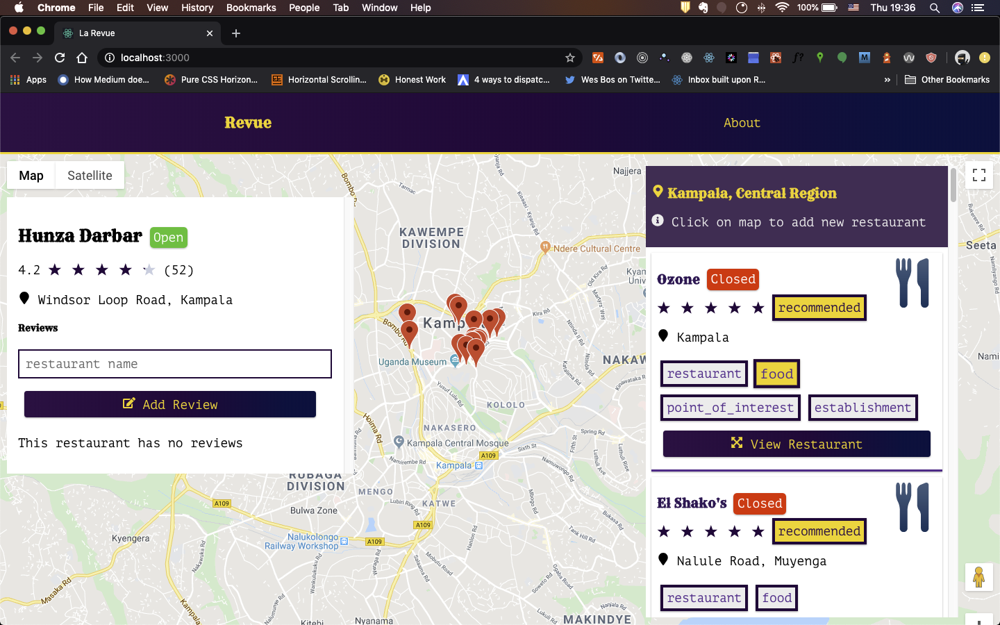

# La Revue
A restaurant reviewing website that allows you to find restaurant and leave reviews based on your geographical location.

## Overview

La Revue is a fictional restaurant reviewing website that allows users to anonymously add and review restaurants.   
- Real restaurant data is fetched from Google Places API by detecting a user's current location via Google's Geolocation API.
- Forms are available for users to add restaurants and reviews.
- All restaurants and reviews are first persisted into a MongoDB database before getting served to the user.
- To separate concerns, reviews get added to a custom database instead of the actual restaurant to prevent unwanted reviews.
- No authentication mechanism has been implemented, all reviews are completely anonymous.

## Features
- [x] List Restaurants
- [x] Add Reviews
- [x] Add Restaurants
- [x] Google Street Views
- [ ] Restaurant Search/Filtering
- [ ] Dark and Light Modes.
- [ ] Responsive Design
- [ ] Enhance Accessibility
- [ ] Statically Overlayed Side Panel

## Live Demo
The app is deployed on heroku and can be found at this **[URL](https://morning-beach-13124.herokuapp.com/)**

## Running locally

You will need the following dependencies installed on your system.
- [Node.js](https://nodejs.org/en/).
- [NPM](https://www.npmjs.com/) or [Yarn](https://yarnpkg.com/lang/en) (both come with Node.js.
- A web or a mobile browser.

### Installation
- Clone the repository using `git clone git+https://github.com/Emmanuel-Melon/la-revue.git`.
- Run `cd la-revue` on your terminal or command line interface.
- Run `yarn install` or `npm install`.
- Open your browser and visit `http://localhost:5000`.

## Built with
### ECMAScript 7 (“ES7” / JavaScript)
ECMAScript™ is the standard behind JavaScript. It has had a number of very useful additions over the past several years, modernizing the syntax and providing new capabilities.  
[**Learn More**](https://www.ecma-international.org/ecma-262/10.0/index.html)

### Node.js
Node.js® is a JavaScript runtime built on Chrome's V8 JavaScript engine. It allows you to run JavaScript code on server environments.  
[**Learn More**](https://nodejs.org/en/)

### React.js
React is a JavaScript library for building user interfaces. It is maintained by Facebook and a community of individual developers and companies.   
[**Learn More**](https://reactjs.org/)

### MongoDB
MongoDB is a general purpose, document-based, distributed database built for modern application developers and for the cloud era. No database makes you more productive.    
[**Learn More**](https://www.mongodb.com/)

### Google Maps APIs
Google Maps is a web mapping service developed by Google. It offers satellite imagery, aerial photography, street maps, 360° panoramic views of streets, real-time traffic conditions, and route planning for traveling by foot, car, bicycle and air, or public transportation.  
[**Learn More**](https://cloud.google.com/maps-platform/)

